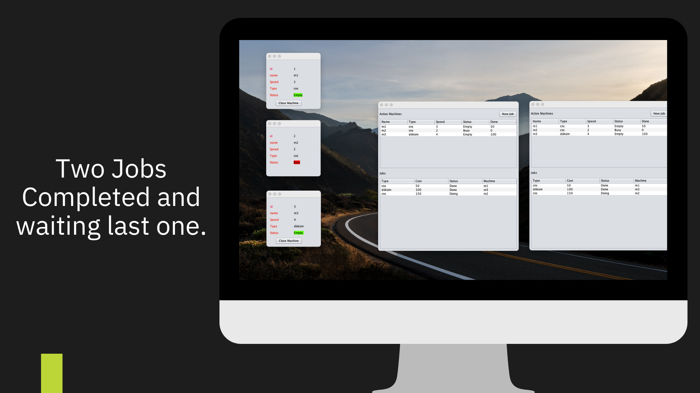

# MyVirtualFactory

1. Open a Server 
2. Open One or More Clients
3. Choose Client Type (Planner/Machine)
4. Planner Client must be login with username and password (user: ali pass:123)
5. Add New Job to do. 
6. Wait for the jobs to be completed.

